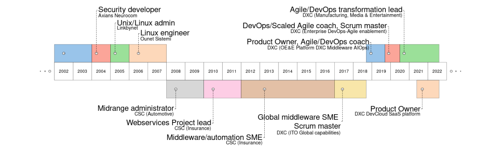

*This resume is leveraging DevOps 🚀 (automatically built from [source
code by a CI/CD pipeline](https://github.com/bbourdin/resume/))*.

**Resume:**
[HTML](https://bbourdin.github.io/resume//index.html/index.html) /
[Markdown](https://github.com/bbourdin/resume//blob/gh-pages/Benoit-Bourdin-resume.md)
/ [PDF](Benoit-Bourdin-resume.pdf) / [Word](Benoit-Bourdin-resume.docx).
**One-slide**: [One-slide HTML](Benoit-Bourdin-slide.html) /
[Powerpoint](Benoit-Bourdin-slide.pptx) /
[PDF](Benoit-Bourdin-slide.pdf) / [PNG](Benoit-Bourdin-slide.png).

[Like it? I would ❤️ your
feedback!](https://forms.gle/uicsQT38UznBk6rcA). Be notified 🔔 on
updates:
[watch](https://docs.github.com/en/get-started/quickstart/be-social#watching-a-repository)
[the GitHub repository](https://github.com/bbourdin/resume/).

Profile
-------

<!-- for all-latex based output formats (pdf, md) -->
<!-- for other output formats -->

<table>
<colgroup>
<col style="width: 34%" />
<col style="width: 65%" />
</colgroup>
<thead>
<tr class="header">
<th><strong><a href="https://github.com/bbourdin">GitHub profile</a></strong></th>
<th>
💭 <strong><a href="https://www.linkedin.com/in/benoit-bourdin-b9b2642/">LinkedIn</a> / <a href="mailto:benoit.bourdin@gmail.com" class="email">benoit.bourdin@gmail.com</a></strong>

<strong><a href="https://zcal.co/i/CewT_0LV">Schedule a call</a> ☎️</strong></th>
</tr>
</thead>
<tbody>
<tr class="odd">
<td><strong>Total experience:</strong> 18 Years</td>
<td><strong>Experience in DXC:</strong> 14 Years</td>
</tr>
<tr class="even">
<td><strong>Visa/Work permit:</strong> N/A</td>
<td><strong>Validity Date of Visa/Work Permit:</strong> N/A</td>
</tr>
<tr class="odd">
<td><strong>Willing to relocate:</strong> No</td>
<td><strong>Willing to travel:</strong> Yes (up to 10%)</td>
</tr>
</tbody>
</table>

### 100-word biography/profile presentation

Benoit is the **Product Owner** of the DXC **central Agile/DevOps SaaS
platform** to 28,000 active users, and is **leading** the **Agile/DevOps
transformation** of several DXC teams, organizations and customers, by
**coaching** on the **Agile/Lean/DevOps** culture, practices and the
tools. He is also contributing in several communities of practice and
for pre-sales.

Previously, Benoit has also worked as product owner of an AIOps/NoOps
SaaS B2B platform, and as middleware & automation SME in DXC, leading
projects for large customers, global standards for all customers. Before
DXC, Benoit worked as system administrator, software developer and
network administrator.

**More details below**:

👉 [Portfolio of managed products](#portfolio-of-managed-products) /
[Some of the Teams I could lead](#some-of-the-teams-i-could-lead) /
[Recent performance](#recent-performance)

👉 [Experience](#experience) / [Skills](#skills) / [Experience
detailed](#experience-detailed) / [Education and
other](#education-and-other)

Portfolio of managed products
-----------------------------

### *DXC DevCloud - central Agile/DevOps SaaS platform (Product Owner in 2021-2022)*

**Users 👨**: **28,000** (active) users, delivering software using
Agile/DevOps practices.

**Business value 💸**: Individual Property, agility, Developer
eXperience, speed, quality for **900+ customers**.

**Technology 🚀**: AWS, Kubernetes, Terraform, CloudFormation, Ansible,
Helm… to deploy **Jira, GitHub, Jenkins, Artifactory, Confluence** using
38 CI/CD pipelines.

**Team 👥**: 3 proxy product owners, **15 DevOps engineers** and our bot
🤖 for 70% of the requests.

-   **Measuring 💹** data/trend of NPS, service, user base, feature
    usage, costs in every sprint review.
-   Introduced **monetization 💱** by a freemium service-based model.
    Made **transparent** 🆗 300 **risks and debts** and 100 user
    requirements. **Prioritization** using impact/probability and
    impact/effort. 100 knowledge risks resolved, by a new **learning
    organization** 🏫.
-   **Improved** 📈 **NPS to +95%**, availability from 97% to 99.6%, MTTR
    from 7 to 1 day, monetization by 25% and unblocked the delivery of
    300 **user features**.

------------------------------------------------------------------------

### *[Platform-X](https://dxc.com/us/en/about-us/how-we-deliver/platform-x) Content Middleware - AIOps SaaS B2B platform (Product Owner in 2018-2019)*

**Users 👨**: **3.3M users** managing the IT estate of **450+
customers**. - **Team 👥**: **5 engineers**.

**Business value 💸**: **AIOps** B2B SaaS, automated discovery/monitoring
of **hundreds of** middleware **instances** in ***few hours***. **50-75%
automated resolution** of incidents, designed for **NoOps**.

**Technology 🚀**: ServiceNow (CMDB, Flow, Incident), Microfocus UD,
Nagios, API, JSON, Python.

-   Dual-track Agile. **Product exploration and design**,
    strategy/roadmap, resource **hiring**. Development supporting the
    top \#5 products, top \#20 metrics and top \#10 incidents.
    **Data-driven** value/effort **prioritization** and **OKRs**, based
    on configuration/incident data @scale. **Progressive delivery** and
    **launch**. Improved the **coordination** for the end-to-end
    integration including external vendors, **from *months* to
    *weeks***. Improved the **testing** process **from *2 months* to few
    *hours***.

Some of the Teams I could lead
------------------------------

### *Agile Marathon (Arvan) team (Scrum master in 2020)*

**Team 👥**: **9 coordinators**. **Purpose ✈️**: Staff organizing a
global 24-hours **conference on Agile**.

**Way of working 👉**: **Culture of Agility**, **sprints** evolved from 4
weeks to **2 days**. **Asynchronous communication**.

**Outcomes 🌠**:

-   best **team experience**, best communication (100 teams
    messages/month), **high performance** team managing 381 work items
    over 12 sprints. Huge **team learning** 🏫, all members felt then
    prepared for a scrum master role.
-   **2,348 attendees** and viewers to the event, 245 Q&As - **eNPS:
    +90%**, 90% considered it generated a **business value**.
-   **1,519 subscribed** followers on our social network group, about
    100 views per session.

------------------------------------------------------------------------

### *Agile/DevOps Enablement team (Scrum Master/RTE in 2019-2020)*

**Team 👥**: **15 engineers**. **Purpose ✈️**: Targeting 200,000+
employees to embrace the **Agile/DevOps transformation**, coaching and
providing a **central platform**.

**Way of working 👉**: **SAFe** evolved to Scrum and **Kanban**.
**Agility** also during organizational changes. Some members assigned to
a critical waterfall project during few months.

**Outcomes 🌠**:

-   Managed the **challenges** of attrition, knowledge transfer/gaps,
    COVID, quick **changes in the team** with few days of notice,
    changes on **priorities** and ways of working, risk management.
-   **No outage** 🙆‍♂️, met critical deadlines on external projects,
    **continuous flow** of delivery using Kanban
-   **Smooth transition** of the management, product manager, team,
    solid knowledge base.

------------------------------------------------------------------------

### *Global capability Middleware team (Scrum master in 2017-2018)*

**Team 👥**: **9 engineers**. **Purpose ✈️**: Global **optimization of
all delivery operations** for the **middleware** capability, establish
**standards and automation** solutions.

**Way of working 👉**: From waterfall, introduced **Kanban**, **design
sprints**, and then **Scrum**.

**Outcomes 🌠**:

-   **Transparency** 🙆‍♀️ on the work in progress, made **success
    visible**. Decisions and **OKRs** based on **data** 💹 extraction and
    analytics.
-   Fostered **innovation and learning** 🏫, **new practices and tools**
    like some of the DevOps patterns.
-   Continuous **flow**, **improved communication** (people in all
    timezones), collaboration and teamwork.

Recent performance
------------------

**Quotes** from our customers or account executive during 2022:

> “*Sharing thanks and appreciation for Benoit’s good work for \[this
> customer\]. He is contributing and supporting in a great way for my
> team.*”
>
> > Regional Account Delivery Lead - Manufacturing

> “*I would like to also thanks Benoit for all his help completing the
> VSM for our team. His deep knowledge and understanding help us achieve
> this in a very reasonable and short time. I can’t wait to continue
> working with him as we move to the next step. \[It is an\] outstanding
> job you are doing when coaching us that benefits DXC and \[the
> customer\].*”
>
> > Application Development lead - Manufacturing

> “*Benoit is very responsive and helpful - anytime we have questions or
> need help looking into solutions, he provides detailed responses and
> includes multiple options/choices for solutions that make it easier
> for us to make informed decisions.*”
>
> > Director of IT applications - Media & Entertainment

> “*Benoit is very knowledgeable within his domain, he is able to answer
> all the questions we have. If he doesn’t have the answer, he will
> diligently research them and respond without us having to remind
> him.*”
>
> > Project manager - Media & Entertainment

------------------------------------------------------------------------

Experience
----------

### Key Roles Performed

-   Agile/Lean/DevOps Transformation Lead and enterprise Coach (4 years)
-   Product Owner (2 years), Scrum Master (2 years), Supervisor/team
    leader (2 years)
-   Global Middleware SME (2 years), Middleware/automation SME (10
    years)
-   System administrator (5 years), Software Developer (2 years),
    Network administrator (2 years)

Skills
------

### Top Skills (Technical/Nontechnical skills)

-   Agile and DevOps culture, methods and tools (4 years), Lean and
    Value Stream Management (2 years)
-   Product management, leadership of engineering and service (2 years)
-   Middleware: web servers, application servers (11 years)
-   ITSM practice (10 years), Unix/Linux (10+ years), Software
    development (Java, C, Shell… - 2 years), Networking (2 years)

Experience detailed
-------------------

### DXC Technology

-   *[DXC
    DevCloud](https://github.dxc.com/pages/Platform-DXC/devcloud-docs/)*
    (from 2021) - **Product Owner of the Agile/DevOps central platform -
    SaaS**
    -   Product owner of the Agile/DevOps central platform, to 28,000
        (active) users. Consisted of tools (hosted on AWS) for agile
        (Jira), source code/innersource (GitHub), CI/CD (Jenkins),
        artifacts (Artifactory), documentation management (Confluence)
        and focusing the best Developer eXperience (Dx)
    -   Managing a team of 15 DevOps engineers plus a bot and 38 CI/CD
        pipelines we develop and maintain. Built a team of 3 proxy
        product owners and 2 scrum masters.
    -   Outcomes and value-driven, created and managing a backlog of 72
        epics containing features, defects, risks and technical debt.
        Balancing priorities based on impact/effort, distribution and
        knowledge gaps. Continuous roadmapping, management of risks and
        technical debt (300 not identified earlier) with an
        impact/probability prioritization. Duplicated the development
        delivered and service level of the team against the original
        sprint commitment.
    -   Created automated dashboards to measure/review the customer
        experience (UX/DX), flows/increments of development/operations
        (flow metrics), production (service) and costs after every
        sprint of 2 weeks (using Power BI, R, Grafana, AWS and
        Confluence).
    -   Definition of the vision and strategy, innovation using a
        Freemium service-based model for monetization and to regulate
        the internal cost and demand. Charging based on service request,
        vision of tier-based subscriptions. Leading the internal
        marketing together with the team, using our enterprise
        communication tools and enterprise communities.
    -   Leveraging our existing communities of practices to empathize
        with our customers and the business context.
-   *Large manufacturing customer* (from 2020) - **Agile and DevOps
    Transformation Lead**
    -   Leading the DevOps/Lean/Agile enablement team (team of coaches)
        for this account. Weekly consulting on agility, scaling agile
        and team topologies, Kanban for flow management, training, agile
        tooling, value stream mapping, measurement of business outcomes.
    -   Led two Value Stream Mapping (VSM) workshops, clarified team
        APIs, implementation of a continuous improvement framework with
        the leaders, leveraging transformation patterns for small and
        specific improvements using a Kata template.
    -   Identification of the transformation expected outcomes in
        partnership with the customer, and implementation of the
        measurements.
-   *Entertainment industry customer* (from 2020) - **Scaled Agile Coach
    and Agile Platform Lead**
    -   Coaching the customer for improved workflows, SAFe
        implementation (with Jira BigPicture/Advanced roadmaps) and
        employee experience (with Jira service desk). Leading the agile
        platform admin team (Jira) on daily support and the community of
        practice. Advising on the process/tooling strategy and
        licensing.
-   *DXC community (from 2017)* - **agile/DevOps Coach and leader of
    communities of practice**
    -   Pre-sales of coaching services, delivery of coaching services
        (also called advisory or enablement services). Value Stream
        Mapping workshops for several customers.
    -   Agile and DevOps coaching for other customers and internal
        organization, for their specific question or use case,
        leveraging many other different patterns, practices and tools.
    -   Co-leader of the main DevOps/Lean/Agile and of the team
        topologies community of practice in DXC. Contributor to all the
        other DevOps/Lean/Agile communities of practice (presentations,
        consulting, creation of re-usable assets…) including Agile
        contracting, Value Stream Mapping,
        <a href="mailto:Agile@scale" class="email">Agile@scale</a>, SRE…
        Speaker on different topics like asynchronous communication,
        agile metrics, GitOps, DataOps. Speaker on different topics like
        asynchronous communication, agile metrics, GitOps, DataOps.
    -   Speaker and part of the staff (scrum master) of the DXC Agile
        Marathon every year, which is a global event of 24 hours with
        presentations from all our best agile champions. Driving the
        staff to be an high performance agile team using innovation,
        Scrum (ex: sprints of 2 days), Azure DevOps. Driving the staff
        to be an high performance agile team using innovation, Scrum
        (ex: sprints of 2 days), Azure DevOps.
-   *[Enterprise Agile/DevOps
    enablement](https://github.dxc.com/pages/bionix/storefront/products/DevOps/)
    team* (2019-2020) - **DevOps/Scaled Agile Coach**
    -   Coaching at scale, coaching coaches, targeting 200,000+
        employees to embrace the DevSecOps and Scaled Agile
        transformation to maximize the value stream.
    -   Participating on the product owning (of the [DXC
        Jira](https://github.dxc.com/pages/Platform-DXC/devcloud-docs/jira/%20platform),
        Scrum/Kanban flow (Dev and Ops), architecture (Jira cloud),
        engineering of our [DevCloud
        platform](https://github.dxc.com/pages/Platform-DXC/devcloud-docs/),
        a ready-to-use platform to easily achieve the DevSecOps/Agile
        practice to 20,000+ users by doing both Dev (Node.JS, Groovy,
        Python, Java…) and Ops (AWS, Docker, Linux, middleware, DB…).
        Co-leading the [major migration to Jira
        8](https://dxc.workplace.com/groups/DevCloud/permalink/690211148207878/).
    -   Improved practice by collaboration to our communities on most of
        the Agile and DevOps culture and principles, including Lean,
        CI/CD, everything as code, Value Stream Mapping, team
        topologies.
    -   Scaled Agile coaching, embracing the Lean/Agile practice by
        being a principal support in [OE&E Scaled
        Agile](https://github.dxc.com/Platform-DXC/ScaledAgile/) (1500+
        individuals), coaching the PMO, Program and Teams.
    -   Scrum master and then Release Train Engineer (RTE) for the team
        during a transition period of 6 months. Managed the challenges
        of attrition, knowledge transfer/gaps, COVID, quick changes on
        priorities and ways of working, risk management. No outage
        visible to the users, met critical deadlines, ensured a
        continuous flow of delivery using Kanban, supported the product
        manager/owners and management on the changes.
-   *OE&E (Operations Engineering and Excellence)* (2018-2019) -
    **Platform DXC/Platform-X (AIOps B2B SaaS) middleware Product Owner,
    Agile/DevOps Coach**
    -   Product Owner of the Platform DXC/CVA middleware content
        ([end-to-end
        discovery/monitoring/auto-healing](https://github.dxc.com/Platform-DXC/architecture/blob/master/Cross-Pillar-Processes-and-Flows/Discovery-to-RBA.md)
        of [middleware
        instances](https://github.dxc.com/Platform-DXC/monitoring-catalog#middleware)
        for an AIOps/NoOps platform), team leader/supervisor of the
        middleware team. Optimizing the ROI by setting priorities and
        optimizing resources. Dual-track Agile (exploration/development,
        roadmapping, design, risk and dependencies management. Team
        building, facilitating the communication and onboarding new
        resources.
    -   Automation and Middleware chief architect, working on the end to
        end DevOps automation chain integrated in the next digital
        transformation platform of our global company (Platform
        DXC/Platform-X and the Customer Virtual Appliance - CVA/Edge-X).
    -   Supporting/improving the [development
        process](https://github.dxc.com/OEE-Content-Factory/PDXC-Content-Process/),
        ROI (by being product owner), and design of these solutions,
        progressive launch and delivery to new customers.
    -   DevOps and ScaledAgile coach, daily supporting programs, scrum
        masters, leads and teams of 100+ developers to their
        Agile/DevOps transformation. Improving their Agile maturity,
        embracing and improving the [Scaled Agile
        implementation](https://github.dxc.com/Platform-DXC/ScaledAgile/)
        of the organization. Leading the DevOps implementation, bringing
        innovation, for example by deploying [testing
        pipelines](https://github.dxc.com/OEE-Content-Factory/PDXC-Content-testing/),
        [test
        automation](https://github.dxc.com/Ansible-Global/jenkins-ansibletest-lib)
        or
        [GitOps](https://github.dxc.com/OEE-Content-Factory/GitOps-PDXC-ansible-lib).
-   *IT Operations global capabilities* (2017-2018) - **Global
    capability middleware SME**
    -   Optimization of the delivery operations for the middleware
        capability, in all the service management areas. Establishing
        standards and best practices globally for all the middleware
        installations in DXC. Supporting the development of automation
        (python, shell) and the development of automation (python,
        shell) and the delivery team of all the accounts worldwide for
        any technical concern.
    -   Leading the middleware automation (DevOps and Bionix)
        initiatives, supporting the digital transition by building new
        standards using new methods (Agile) and tools (Jenkins, GitHub,
        Artifactory, Ansible/IAF/Raffia, docker, AWS, Jira, Azure DevOps
        …).
    -   Scrum master, improving transparency and delivery flow of the
        team

### Computer Sciences Corporation (CSC)

Prior to the merge of CSC to DXC Technology:

-   *Large insurance customer* (2012- 2017) - **Middleware and
    automation SME**
    -   Leading middleware automation & DevOps solutions. Suitable for
        provisioning, configuration and deployments on the middleware,
        and integration with the Cloud (DXC Agility). Mainly using
        Ansible, GIT, Bitbucket, Bamboo.
    -   Building standards and solutions for WAS, tomcat , JBoss,
        Weblogic, Apache.
    -   Worked on high-scale/pressure projects, under a direct
        visibility from the CIO, including :
        -   Kolumbus: application modernization program, automation of
            the end-to-end provisioning and configuration of the
            middleware+application (100+ instances) using
            DevOps/Ansible, $5.5M revenue, Benoit received an award for
            the Project Management Excellence FY18
        -   Data center move: coordination of the middleware activities
            and application troubleshooting during the data center move
            events (1000+ applications), automation of the network
            assignment. F2F recognition from the customer CIO, our CEO
            directly recognized our team for this project in a meeting
            call.
    -   Third level support, problem solving, optimization.
-   *Large insurance customer* (2010-2012) - **European Webservices
    Project lead **
    -   Leading infrastructure projects and architecture decision of
        Webservices team for half of the Insurance business units. Time
        and resource management (nearshore+offshore).
    -   Communication with the client, and all DXC teams (SM, PM,
        architects…)
    -   IBM Websphere application server 8.5 + apache full installation
        and administration. Third level support, problem solving,
        optimization.
    -   Building standards and solutions for WAS, JBoss, Tomcat,
        Weblogic
-   *Large automotive customer* (2008-2010) - **JavaEE and Websphere
    expert, midrange administrator**
    -   IBM Websphere application server (WAS3,4,5,6,7 and WAS CE1,2) +
        apache full installation and administration. Third level support
        : analyzing, optimization and fine troubleshooting.
    -   Training and supervising a technical team in India.
    -   Leading technical projects, with direct communication to the
        client and Service Delivery Managers.
    -   Application management : documentation revision, monitoring
        management, incident and problem solving, RCA owning.
    -   JBoss and tomcat administration. Shell and JACL+ Jython
        scripting, occasional Unix/Linux and network activities.

### Previous Relevant Work Experience

-   *OUnet Sistemi (Rome, Italy) - Novell Partner* (2006-2008) -
    **Linux/Windows engineer** Monitoring systems (Nagios), wireless
    (Cisco WLC) and SLES/OES servers installation and administration,
    user support.

-   *Linkbynet (Saint Denis, France)* (2005-2006) - **Linux/Windows
    engineer** Installing OS&applications (Apache/MySQL, Oracle,
    Websphere…) in a production network (450 servers, 1000 clients).
    Bash and Perl programming, network security.

-   *Axians Neurocom (Le Pecq, France), Vinci Energies* (2005) -
    **Security engineer** Security and intrusive tests. Vulnerability
    lookup, exploit demos, source code audit, Perl programming for
    Nessus.

-   *Several companies in Paris, France* (2002-2004) - **Several roles**
    Technical trainer, C++/network programming, C programming for
    Nagios+Squid, Linux clustering administration, networking (cisco)
    administration.

------------------------------------------------------------------------

### Previous work Rewards/Recognition

-   [FY20Q3 recognition in the organization
    (OE&E)](https://dxcportal.sharepoint.com/sites/bionics/_layouts/15/Doc.aspx?sourcedoc=%7BC62D4844-44AD-4CA0-BE9F-71B27AA193A2%7D&file=OE%26E%20All%20Employee%20Town%20Hall%20-%20January%2028th%202020.pptx&action=edit&mobileredirect=true)
    as Middleware SME and Agile/DevOps coach

-   [FY18 Project Management
    Excellence](https://my.dxc.com/our-company/operating-model/deliver/2018-pm-award-winners-.html)
    for the Kolumbus Guidewire Program in the Large insurance customer

### Industry Experience

-   Manufacturing – 2 years
-   Media/Entertainment – 1 year
-   Insurance – 7 years
-   Automotive – 3 years
-   Legal service – 2 years

------------------------------------------------------------------------

Education and other
-------------------

09/2005 Master’s degree in Networks and Telecommunications, Paris XI
university, Orsay, France.

07/2004 Degree and master’s in computer science Paris XI, Orsay, France.

07/2002 Polytechnic university (DUT informatique), IUT Orsay, France.

07/1999 A Level of Science (Baccalaureat), Saint Vincent school, Senlis,
France.

------------------------------------------------------------------------

### Certifications (Professional Activities, Certifications, and Training Attended)

-   Agile practices (official training) - 2019
-   Architecting on AWS (official training) - 2016
-   IBM Websphere Application Server (official trainings) :
    -   V6 - 2008
    -   V8.5 - 2014
    -   performance tuning and security - 2015
-   Oracle Weblogic administration 12c (official training) - 2015
-   IBM Filenet (official training) - 2015
-   IBM ITCAM – 2014
-   Information Technology Infrastructure Library (ITIL,
    training+certification) – 2014
-   Solaris (official training) – 2008
-   Novell Suse 10 (CLP and CLE certifications) - 2008

### Languages

French: mother tongue

Spanish: fluent (living&working in Spain since 2008)

Italian : fluent (2 years living&working in Italy)

English: high (12 years working in English, 4 years for customers in US)

German : good skills/A1

### Hobbies/personal

I use to spend most of my personal time taking care of my two kids (7
and 9 years), but also in gardening at home and sailing in the
Cantabrian Sea.
