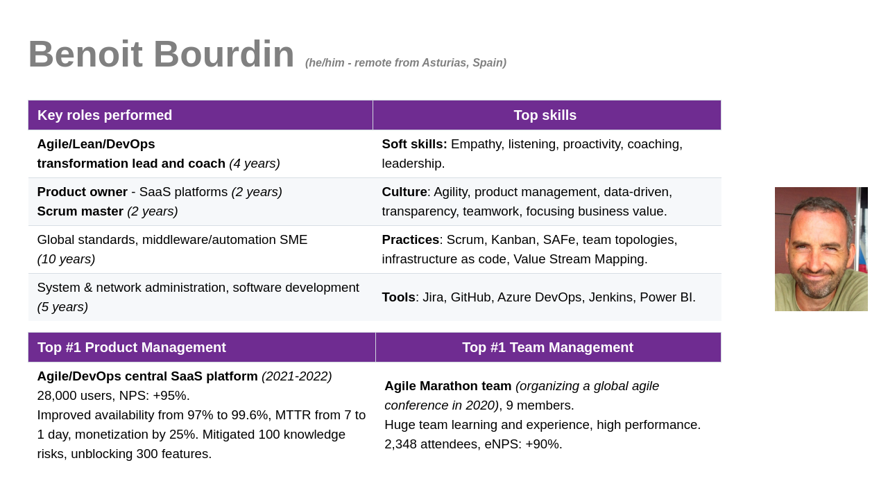
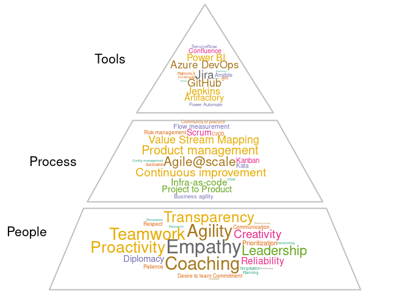

**This resume is leveraging DevOps**: *Automatically built from [source
code by a CI/CD pipeline](https://github.com/bbourdin/resume/)), and can
be downloaded as
[HTML](https://github.com/bbourdin/resume/blob/gh-pages/),
[PDF](Benoit-Bourdin-resume.pdf),
[Markdown](https://github.com/bbourdin/resume//blob/gh-pages/Benoit-Bourdin-resume.md)
or [Word](Benoit-Bourdin-resume.docx). One-slide view formats:
[HTML](Benoit-Bourdin-slide.html),
[Powerpoint](Benoit-Bourdin-slide.pptx), [PDF](Benoit-Bourdin-slide.pdf)
or [PNG](Benoit-Bourdin-slide.png). To be notified on updates, go to
[the repository](https://github.com/bbourdin/resume/) and [click on
Watch](https://docs.github.com/en/get-started/quickstart/be-social#watching-a-repository).*

Profile
-------

<table>
<colgroup>
<col style="width: 53%" />
<col style="width: 46%" />
</colgroup>
<thead>
<tr class="header">
<th><strong>Total experience:</strong> 18 Years</th>
<th><strong>Experience in DXC:</strong> 14 Years</th>
</tr>
</thead>
<tbody>
<tr class="odd">
<td><strong>Current Job Title: Agile/DevOps transformation lead</strong></td>
<td><strong>Time in Current Role:</strong> 3 years</td>
</tr>
<tr class="even">
<td><strong>Visa/Work permit:</strong> N/A</td>
<td><strong>Validity Date of Visa/Work Permit:</strong> N/A</td>
</tr>
<tr class="odd">
<td><strong>Willing to relocate:</strong> No</td>
<td><strong>Willing to travel:</strong> Yes</td>
</tr>
</tbody>
</table>

### Contact

| Email ID                                                                             | Contact                                                                                                 |
|--------------------------------------------------------------------------------------|---------------------------------------------------------------------------------------------------------|
| <a href="mailto:benoit.bourdin@gmail.com" class="email">benoit.bourdin@gmail.com</a> | [GitHub](https://github.com/bbourdin) / [LinkedIn](https://www.linkedin.com/in/benoit-bourdin-b9b2642/) |

------------------------------------------------------------------------

### 100-word biography/profile presentation

Benoit is leading the DevOps and Agile transformation of several DXC
teams, organizations and customers, by coaching on the Agile/Lean/DevOps
culture, practices and the tools. He is also contributing as product
owner for a platform to 28,000 active users, in several communities of
practice and for pre-sales.

Previously, Benoit has also worked as middleware & automation SME in
DXC, leading projects for large customers, global standards for all
customers, architectural roadmap of an automation platform and led all
the automation initiatives. Before DXC, Benoit worked as system
administrator, after several experiences in software development and
network administration.

Quotes
------

Here are some quotes from our customers or account executive during
2022:

> “*Sharing thanks and appreciation for Benoit’s good work for \[this
> customer\]. He is contributing and supporting in a great way for my
> team.*”
>
> > Regional Account Delivery Lead - Manufacturing

> “*I would like to also thanks Benoit for all his help completing the
> VSM for our team. His deep knowledge and understanding help us achieve
> this in a very reasonable and short time. I can’t wait to continue
> working with him as we move to the next step. \[It is an\] outstanding
> job you are doing when coaching us that benefits DXC and \[the
> customer\].*”
>
> > Application Development lead - Manufacturing

> “*Benoit is very responsive and helpful - anytime we have questions or
> need help looking into solutions, he provides detailed responses and
> includes multiple options/choices for solutions that make it easier
> for us to make informed decisions.*”
>
> > Director of IT applications - Media & Entertainment

> “*Benoit is very knowledgeable within his domain, he is able to answer
> all the questions we have. If he doesn’t have the answer, he will
> diligently research them and respond without us having to remind
> him.*”
>
> > Project manager - Media & Entertainment

------------------------------------------------------------------------

Experience
----------

### Key Roles Performed

-   Agile/Lean/DevOps transformation lead and coach (4 years)
-   Product owner (2 years)
-   Supervisor/team leader (2 years)
-   Global Middleware SME (2 years)
-   Middleware/automation SME (10 years)
-   System administrator (5 years), Software Developer (2 years),
    Network administrator (2 years)

------------------------------------------------------------------------

Skills
------

### Top Skills (Technical/Nontechnical skills)

-   DevOps culture, practices and tools (4 years)
-   Agile culture, methods and tools (4 years)
-   Lean method, Value Stream Management (2 years)
-   Product management and development (2 years)
-   Middleware: web servers, application servers (11 years)
-   ITSM practice (10 years)
-   Unix/Linux (10+ years), Software development (Java, C, Shell… - 2
    years), Networking (2 years)

------------------------------------------------------------------------

Experience detailed
-------------------

### DXC Technology

-   *Large manufacturing customer* (from 2020) - **Agile and DevOps
    transformation lead**
    -   Leading the DevOps/Lean/Agile enablement team (team of coaches)
        for this account. Weekly consulting on agility, scaling agile
        and team topologies, Kanban for flow management, training, agile
        tooling, value stream mapping, measurement of business outcomes.
        Led two Value Stream Mapping (VSM) workshops, clarified team
        APIs, implementation of a continuous improvement framework with
        the leaders, leveraging transformation patterns for small and
        specific improvements using a Kata template. Identification of
        the transformation expected outcomes in partnership with the
        customer, and implementation of the measurements.
-   *[DXC
    DevCloud](https://github.dxc.com/pages/Platform-DXC/devcloud-docs/)*
    (from 2021) - **Product owner of the Agile/DevOps central platform**
    -   Product owner of the Agile/DevOps central platform, to 28,000
        (active) users. Consisted of tools (hosted on AWS) for agile
        (Jira), source code (GitHub), CI/CD (Jenkins), artifacts
        (Artifactory), documentation management (Confluence), managed by
        a team of 15 people plus a bot and 38 CI/CD pipelines we develop
        and maintain.
    -   Outcomes and value-driven, created and managing a backlog of
        features, defects, risks and technical debt. Balancing
        priorities, distribution and knowledge gaps. Continuous
        management of risks and technical debt thanks to an
        impact/probability matrix. Measuring/reviewing the customer
        experience and the flows/increments of development/operations on
        an automated dashboard after every sprint of 2 weeks (using
        Power BI, R, Grafana, AWS and Confluence).
    -   Created a vision of Freemium model to regulate the cost and
        demand. Leading the internal marketing.
-   *Entertainment industry customer* (from 2020) - **Scaled Agile coach
    and agile platform lead**
    -   Coaching the customer for improved workflows, SAFe
        implementation (with Jira BigPicture/Advanced roadmaps) and
        employee experience (with Jira service desk). Leading the agile
        platform admin team (Jira) on daily support and the community of
        practice. Advising on the process/tooling strategy and
        licensing.
-   *DXC community (from 2017)* - **agile/DevOps coach and leader of
    communities of practice**
    -   Pre-sales of coaching services, delivery of coaching services
        (also called advisory or enablement services). Value Stream
        Mapping workshops for several customers.
    -   Co-leader of the main DevOps/Lean/Agile and of the team
        topologies community of practice in DXC. Contributor to all the
        other DevOps/Lean/Agile communities of practice (presentations,
        consulting, creation of re-usable assets…) including Agile
        contracting, Value Stream Mapping,
        <a href="mailto:Agile@scale" class="email">Agile@scale</a>, SRE…
    -   Speaker and part of the staff (scrum master) of the DXC Agile
        Marathon every year, which is a global event of 24 hours with
        presentations from all our best agile champions.
-   *[Enterprise DevOps/Agile
    enablement](https://github.dxc.com/pages/bionix/storefront/products/DevOps/)
    team* (2019-2020) - **DevOps/Scaled Agile coach**
    -   Coaching at scale, coaching coaches, targeting 200,000+
        employees to embrace the DevSecOps and Scaled Agile
        transformation to maximize the value stream.
    -   Participating on the product owning (of the [DXC
        Jira](https://github.dxc.com/pages/Platform-DXC/devcloud-docs/jira/%20platform),
        Scrum/Kanban flow (Dev and Ops), architecture (Jira cloud),
        engineering of our [DevCloud
        platform](https://github.dxc.com/pages/Platform-DXC/devcloud-docs/),
        a ready-to-use platform to easily achieve the DevSecOps/Agile
        practice to 20,000+ users by doing both Dev (Node.JS, Groovy,
        Python, Java…) and Ops (AWS, Docker, Linux, middleware, DB…).
        Co-leading the [major migration to Jira
        8](https://dxc.workplace.com/groups/DevCloud/permalink/690211148207878/).
    -   Improved practice by collaboration to our communities on most of
        the Agile and DevOps culture and principles, including Lean,
        CI/CD, everything as code, Value Stream Mapping, team
        topologies.
    -   Scaled Agile coaching, embracing the Lean/Agile practice by
        being a principal support in [OE&E Scaled
        Agile](https://github.dxc.com/Platform-DXC/ScaledAgile/) (1500+
        individuals), coaching the PMO, Program and Teams.
    -   Scrum master and then Release Train Engineer (RTE) for the team
        during a transition period of 6 months. Managed the challenges
        of attrition, knowledge transfer/gaps, COVID, quick changes on
        priorities and ways of working, risk management. No outage
        visible to the users, met critical deadlines, ensured a
        continuous flow of delivery using Kanban, supported the product
        manager/owners and management on the changes.
-   *OE&E (Operations Engineering and Excellence)* (2018-2019) -
    **Platform DXC middleware product owner, Agile/DevOps coach**
    -   Product owner of the Platform DXC/CVA middleware content
        (strategic [end-to-end
        monitoring](https://github.dxc.com/Platform-DXC/architecture/blob/master/Cross-Pillar-Processes-and-Flows/Discovery-to-RBA.md)
        product - only [the middleware
        piece](https://github.dxc.com/Platform-DXC/monitoring-catalog#middleware)),
        supervisor of the middleware team. Optimizing the ROI by setting
        priorities and optimizing resources. Roadmapping, risk and
        dependencies management. Team building, facilitating the
        communication and onboarding new resources.
    -   Automation and Middleware chief architect, working on the end to
        end DevOps automation chain integrated in the next digital
        transformation platform of our global company (Platform
        DXC/Platform-X and the Customer Virtual Appliance - CVA/Edge-X).
    -   Supporting/improving the [development
        process](https://github.dxc.com/OEE-Content-Factory/PDXC-Content-Process/),
        ROI (by being product owner), and design of these solutions to
        be onboarded to new and existing customers, spread across 70
        countries and delivered though a network of digital
        transformation delivery centers.
    -   DevOps and ScaledAgile coach, daily supporting programs, scrum
        masters, leads and teams of 100+ developers to their
        Agile/DevOps transformation. Improving their Agile maturity,
        embracing and improving the [Scaled Agile
        implementation](https://github.dxc.com/Platform-DXC/ScaledAgile/)
        of the organization. Leading the DevOps implementation, bringing
        innovation, for example by deploying [testing
        pipelines](https://github.dxc.com/OEE-Content-Factory/PDXC-Content-testing/),
        [test
        automation](https://github.dxc.com/Ansible-Global/jenkins-ansibletest-lib)
        or
        [GitOps](https://github.dxc.com/OEE-Content-Factory/GitOps-PDXC-ansible-lib).
-   *IT Operations global capabilities* (2017-2018) - **Global
    capability middleware SME**
    -   Optimization of the delivery operations for the middleware
        capability, in all the service management areas. Establishing
        standards and best practices globally for all the middleware
        installations in DXC. Supporting the delivery team of all the
        accounts worldwide for any technical concern.
    -   Leading the middleware automation (DevOps and Bionix)
        initiatives, supporting the digital transition by building new
        standards using new methods (Agile) and tools (Jenkins, GitHub,
        Artifactory, Ansible/IAF/Raffia, docker, AWS, Jira, Azure DevOps
        …).
    -   Scrum master, improving transparency and delivery flow of the
        team

### Computer Sciences Corporation (CSC)

Prior to the merge of CSC to DXC Technology:

-   *Large insurance customer* (2012- 2017) - **Middleware and
    automation SME**
    -   Leading middleware automation & DevOps solutions. Suitable for
        provisioning, configuration and deployments on the middleware,
        and integration with the Cloud (DXC Agility). Mainly using
        Ansible, GIT, Bitbucket, Bamboo.
    -   Building standards and solutions for WAS, tomcat , JBoss,
        Weblogic, Apache.
    -   Worked on high-scale/pressure projects, under a direct
        visibility from the CIO, including :
        -   Kolumbus: application modernization program, automation of
            the end-to-end provisioning and configuration of the
            middleware+application (100+ instances) using
            DevOps/Ansible, $5.5M revenue, Benoit received an award for
            the Project Management Excellence FY18
        -   Data center move: coordination of the middleware activities
            and application troubleshooting during the data center move
            events (1000+ applications), automation of the network
            assignment. F2F recognition from the customer CIO, our CEO
            directly recognized our team for this project in a meeting
            call.
    -   Third level support, problem solving, optimization.
-   *Large insurance customer* (2010-2012) - **European Webservices
    Project lead **
    -   Leading infrastructure projects and architecture decision of
        Webservices team for half of the Insurance business units. Time
        and resource management (nearshore+offshore).
    -   Communication with the client, and all DXC teams (SM, PM,
        architects…)
    -   IBM Websphere application server 8.5 + apache full installation
        and administration. Third level support, problem solving,
        optimization.
    -   Building standards and solutions for WAS, JBoss, Tomcat,
        Weblogic
-   *Renault/Nissan/RCI* (2008-2010) - **JavaEE and Websphere expert,
    midrange administrator**
    -   IBM Websphere application server (WAS3,4,5,6,7 and WAS CE1,2) +
        apache full installation and administration. Third level support
        : analyzing, optimization and fine troubleshooting.
    -   Training and supervising a technical team in India.
    -   Leading technical projects, with direct communication to the
        client and Service Delivery Managers.
    -   Application management : documentation revision, monitoring
        management, incident and problem solving, RCA owning.
    -   JBoss and tomcat administration. Shell and JACL+ Jython
        scripting, occasional Unix/Linux and network activities.

### Previous Relevant Work Experience

-   *OUnet Sistemi (Rome, Italy) - Novell Partner* (2006-2008) -
    **Linux/Windows engineer** Monitoring systems (Nagios), wireless
    (Cisco WLC) and SLES/OES servers installation and administration,
    user support.

-   *Linkbynet (Saint Denis, France)* (2005-2006) - **Linux/Windows
    engineer** Installing OS&applications (Apache/MySQL, Oracle,
    Websphere…) in a production network (450 servers, 1000 clients).
    Bash and Perl programming, network security.

-   *Axians Neurocom (Le Pecq, France), Vinci Energies* (2005) -
    **Linux/Windows engineer** Monitoring systems (Nagios), wireless
    (Cisco WLC) and SLES/OES servers installation and administration,
    user support.

-   *Several companies in Paris, France* (2002-2004) - **Several roles**
    Technical trainer, C++/network programming, C programming for
    Nagios+Squid, Linux clustering administration, networking (cisco)
    administration.

------------------------------------------------------------------------

### Previous work Rewards/Recognition

-   [FY20Q3 recognition in the organization
    (OE&E)](https://dxcportal.sharepoint.com/sites/bionics/_layouts/15/Doc.aspx?sourcedoc=%7BC62D4844-44AD-4CA0-BE9F-71B27AA193A2%7D&file=OE%26E%20All%20Employee%20Town%20Hall%20-%20January%2028th%202020.pptx&action=edit&mobileredirect=true)
    as Middleware SME and Agile/DevOps coach

-   [FY18 Project Management
    Excellence](https://my.dxc.com/our-company/operating-model/deliver/2018-pm-award-winners-.html)
    for the Kolumbus Guidewire Program in the Large insurance customer

### Industry Experience

-   Manufacturing – 2 years
-   Media/Entertainment – 1 year
-   Insurance – 7 years
-   Automotive – 3 years
-   Legal service – 2 years

------------------------------------------------------------------------

Education and other
-------------------

09/2005 Master’s degree in Networks and Telecommunications, Paris XI
university, Orsay, France.

07/2004 Degree and master’s in computer science Paris XI, Orsay, France.

07/2002 Polytechnic university (DUT informatique), IUT Orsay, France.

07/1999 A Level of Science (Baccalaureat), Saint Vincent school, Senlis,
France.

### Certifications (Professional Activities, Certifications, and Training Attended)

-   Agile practices (official training) - 2019
-   Architecting on AWS (official training) - 2016
-   IBM Websphere Application Server (official trainings) :
    -   V6 - 2008
    -   V8.5 - 2014
    -   performance tuning and security - 2015
-   Oracle Weblogic administration 12c (official training) - 2015
-   IBM Filenet (official training) - 2015
-   IBM ITCAM – 2014
-   Information Technology Infrastructure Library (ITIL,
    training+certification) – 2014
-   Solaris (official training) – 2008
-   Novell Suse 10 (CLP and CLE certifications) - 2008

### Languages

French: mother tongue

Spanish: fluent (living&working in Spain since 2008)

Italian : fluent (2 years living&working in Italy)

English: high (12 years working in English, 4 years for customers in US)

German : good skills/A1

### Hobbies/personal

I use to spend most of my personal time taking care of my two kids (7
and 9 years), but also in gardening at home and sailing in the
Cantabrian Sea.
